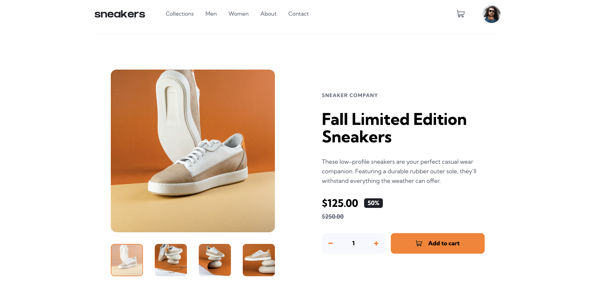

# Frontend Mentor - E-commerce product page solution

This is a solution to the [E-commerce product page challenge on Frontend Mentor](https://www.frontendmentor.io/challenges/ecommerce-product-page-UPsZ9MJp6). Frontend Mentor challenges help you improve your coding skills by building realistic projects.

## Table of contents

- [Overview](#overview)
  - [The challenge](#the-challenge)
  - [Screenshot](#screenshot)
  - [Links](#links)
- [My process](#my-process)
  - [Built with](#built-with)
  - [What I learned](#what-i-learned)
  - [Useful resources](#useful-resources)
- [Author](#author)

## Overview

### The challenge

Users should be able to:

- View the optimal layout for the site depending on their device's screen size
- See hover states for all interactive elements on the page
- Open a lightbox gallery by clicking on the large product image
- Switch the large product image by clicking on the small thumbnail images
- Add items to the cart
- View the cart and remove items from it

### Screenshot



### Links

- Solution URL: [Solution Link](https://github.com/cjoak1028/ecommerce-product-page)
- Live Site URL: [Demo Link](https://ecommerce-product-page-three-flax.vercel.app/)

## My process

### Built with

- Semantic HTML5 markup
- Tailwind CSS
- Flexbox
- Mobile-first workflow

## What I learned

### `object-fit` & `object-position`

I learned that `object-fit` controls how an image is resized within its container, while `object-position` controls which part of the image remains visible when it is cropped.

For example, using `object-cover` fills the entire container while preserving the image's aspect ratio. If the aspect ratios differ, part of the image will be cropped. `object-center` ensures the crop is centered.

```html

```

> **Note:** `object-fit` only has an effect when the image's rendered dimensions are constrained (e.g., by giving the image or its parent a defined width and height).

### The `<fieldset>` Element

I learned that the `<fieldset>` element semantically groups related form controls under a common purpose. Although it is commonly used inside forms, it can also be used outside of a form to group related interactive controls.

In this project, I used a `<fieldset>` to group the product image thumbnails because they function as a single set of mutually exclusive radio buttons for selecting the active product image.

```html
<fieldset id="product-thumbnails-main">
  <legend class="sr-only">Choose product image</legend>
  <label>
    <input
      type="radio"
      name="main-product-image"
      value="1"
      checked
      class="sr-only peer"
    />
    
  </label>
</fieldset>
```

### `has-*`

The `has-*` variant lets you style a parent element based on the state of one of its descendants. This is useful when a child element (such as a checked radio button or focused input) should control the appearance of its container.

In this project, I used `has-checked:*` to highlight the selected product thumbnail by styling the surrounding `<label>` when its radio button is checked.

```html
<label class="has-checked:border-2 has-checked:border-orange-500 rounded-lg">
  <input type="radio" class="sr-only" />
  
</label>
```

### `peer`, `peer-*`, and `peer-has-*`

The `peer` utility allows an element to be styled based on the state of a sibling. The element being observed is marked with the `peer` class, and its siblings can respond using variants such as `peer-checked:*`, `peer-focus:*`, or `peer-has:*`.

In this project, I used `peer-checked:*` to reduce the thumbnail's opacity whenever its associated radio button was selected.

```html
<label>
  <input type="radio" class="sr-only peer" checked />
  
</label>
```

### `group` and `group-*`

The `group` utility lets child elements respond to the state of a parent element. This is commonly used for hover, focus, and active effects that involve multiple elements.

In this project, I used `group-hover:*` so the cart icon changes color whenever the user hovers over the button, rather than the SVG itself.

```html
<button class="group">
  <svg class="fill-gray-500 group-hover:fill-black">...</svg>
</button>
```

### Elements vs. Pseudo-elements

I learned that pseudo-elements (`::before` and `::after`) are best suited for purely presentational content, whereas real HTML elements should be used whenever the content has semantic meaning or requires user interaction.

### Custom Number Input

I learned that browser number inputs include default styles that differ across browsers. To create a consistent, custom-styled number input, these default styles need to be removed.

```html
<input
  type="number"
  class="outline-none appearance-none
         [&::-webkit-inner-spin-button]:appearance-none
         [&::-webkit-outer-spin-button]:appearance-none
         [MozAppearance:textfield]"
/>
```

#### Utilities used

- **`outline-none`**
  - Removes the browser's default focus outline. If removed, a custom focus indicator should be provided to maintain keyboard accessibility.

- **`appearance-none`**
  - Removes the browser's default styling, allowing the input to be fully customized.

- **`[&::-webkit-inner-spin-button]` and `[&::-webkit-outer-spin-button]`**
  - Tailwind arbitrary variants that target Chrome, Edge, and Safari's increment/decrement controls, allowing their default appearance to be removed.

- **`[MozAppearance:textfield]`**
  - A Tailwind arbitrary property that changes Firefox's number input to look like a standard text field, since Firefox doesn't expose the same pseudo-elements as WebKit browsers.

### `Element.closest()`

I learned that `Element.closest()` traverses up the DOM tree, starting from the current element, and returns the nearest ancestor (or the element itself) that matches a given CSS selector.

```js
const deleteButton = event.target.closest(".cart-delete-button");

if (deleteButton) {
  // Handle delete action
}
```

This is especially useful with event delegation, where the event may originate from a nested element (such as an SVG or icon) instead of the element you're interested in.

> **Note:** Use `closest()` when you need to find the nearest matching ancestor of an element.

### `Node.contains()`

I learned that `Node.contains()` checks whether one element is contained within another, including the element itself.

```js
if (!menu.contains(event.target)) {
  closeMenu();
}
```

In this project, I used `contains()` to determine whether a click occurred outside of an element so that it could be dismissed.

> **Note:** Use `contains()` when implementing "click outside" behavior for menus, modals, dropdowns, and other overlays.

### `FormData`

I learned that the `FormData` API provides an easy way to retrieve the values of form controls without manually querying each input.

```js
const formData = new FormData(form);
const quantity = Number(formData.get("quantity"));
```

`FormData` automatically collects the values of successful form controls using their `name` attributes, making it especially useful when working with forms containing multiple inputs.

> **Note:** Use `FormData` to read form values in a structured way instead of manually accessing each input.

#### Useful resources

- [MDN](https://developer.mozilla.org/en-US/)
- [Tailwind Docs](https://tailwindcss.com/)

## Author

- Website - [CJ Kim](https://cjkim.dev/)
- Frontend Mentor - [@cjoak1028](https://www.frontendmentor.io/profile/cjoak1028)
